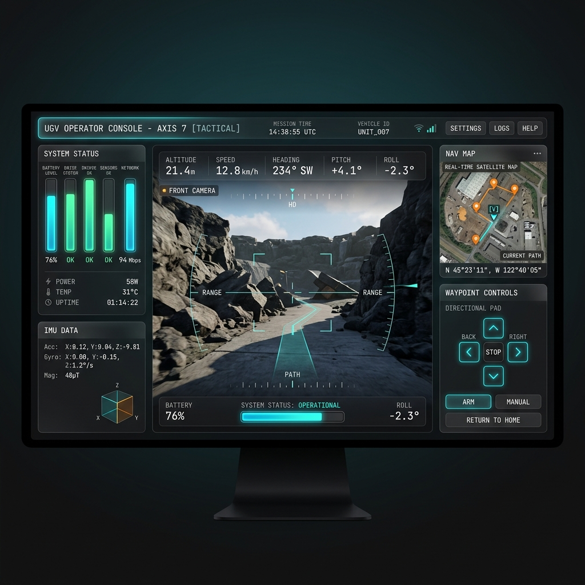
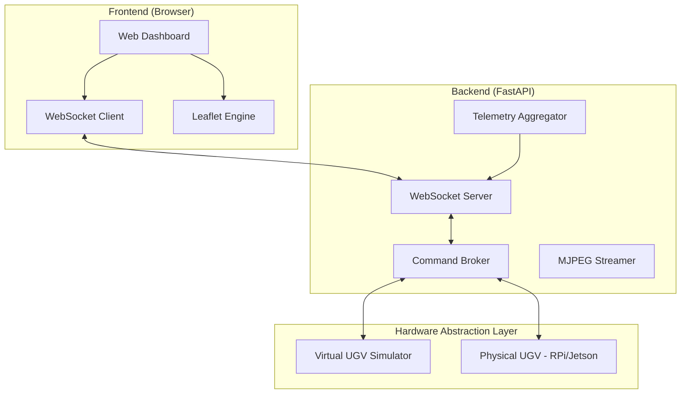

# 🛰️ UGV Teleoperation Web Interface

> **Low-Latency Full-Stack Control Pipeline for Unmanned Ground Vehicles**



[](https://fastapi.tiangolo.com/)
[](https://www.python.org/)
[](https://developer.mozilla.org/en-US/docs/Web/JavaScript)
[](https://developer.mozilla.org/en-US/docs/Web/API/WebSockets_API)

This project is a high-performance, browser-based command and control (C2) interface for Unmanned Ground Vehicles (UGV). It demonstrates a complete end-to-end engineering stack—from asynchronous WebSocket telemetry pipelines to a hardware-agnostic simulation layer.

---

## 🚀 Key Features

- **Real-time Full-Duplex Telemetry**: 20Hz state synchronization (IMU, GPS, Battery) via WebSockets.
- **Low-Latency FPV Stream**: Live MJPEG video delivery optimized for minimal buffering.
- **Multi-Input Control**: Native support for Keyboard (WASD) and Gamepad API.
- **Intelligent Navigation**: Interactive waypoint mission planning using Leaflet.js.
- **Hardware Abstraction Layer (HAL)**: Seamlessly toggle between virtual simulation and real Raspberry Pi/GPIO hardware.
- **Safety Critical**: Integrated hardware-safe Emergency Stop (E-STOP) protocol.

---

## 📂 System Architecture

The system is designed with a modular approach, isolating the UI from the physical hardware via an intermediate FastAPI broker.



### Technical Stack Details

- **Frontend**: Vanilla HTML5/CSS3/ES6+, Leaflet.js, Canvas HUD.
- **Backend**: Python 3.10, FastAPI (Asynchronous I/O), OpenCV (Image processing).
- **Control Strategy**: Differential drive kinematics, state-machine based waypoint navigation.

---

## 🛠️ Installation & Setup

### 1. Prerequisites

- Python 3.9 or higher
- Modern Web Browser (Chrome/Edge recommended for Gamepad API support)

### 2. Implementation

```bash
# Clone the repository
git clone https://github.com/yourusername/ugv-teleoperation.git
cd ugv-teleoperation

# Setup Virtual Environment (Recommended)
python -m venv venv
source venv/bin/activate  # On Windows: venv\Scripts\activate

# Install Core Dependencies
pip install -r backend/requirements.txt

# Launch the Control Server
cd backend
python main.py
```

_Navigate to `http://localhost:8000` to access the C2 Interface._

---

## 🔩 Hardware Integration (HAL)

To transition from simulation to a physical robot, simply update the interface modules in `backend/`:

1.  **Steering/Throttle**: Edit `simulator.py` to interface with `RPi.GPIO` or `PCA9685` via SMBus.
2.  **Sensors**: Update `sensor_sim.py` to read from I2C/SPI devices (e.g., MPU6050, u-blox M8N).
3.  **Optics**: Update `video_sim.py` to use `cv2.VideoCapture(0)` for CSI/USB camera access.

---

## 🧑‍💻 Author

**Naufal Auzan R**
Computer Engineering, Vocational School IPB University
[Portfolio](your-portfolio-url) | [LinkedIn](your-linkedin-url)

---
